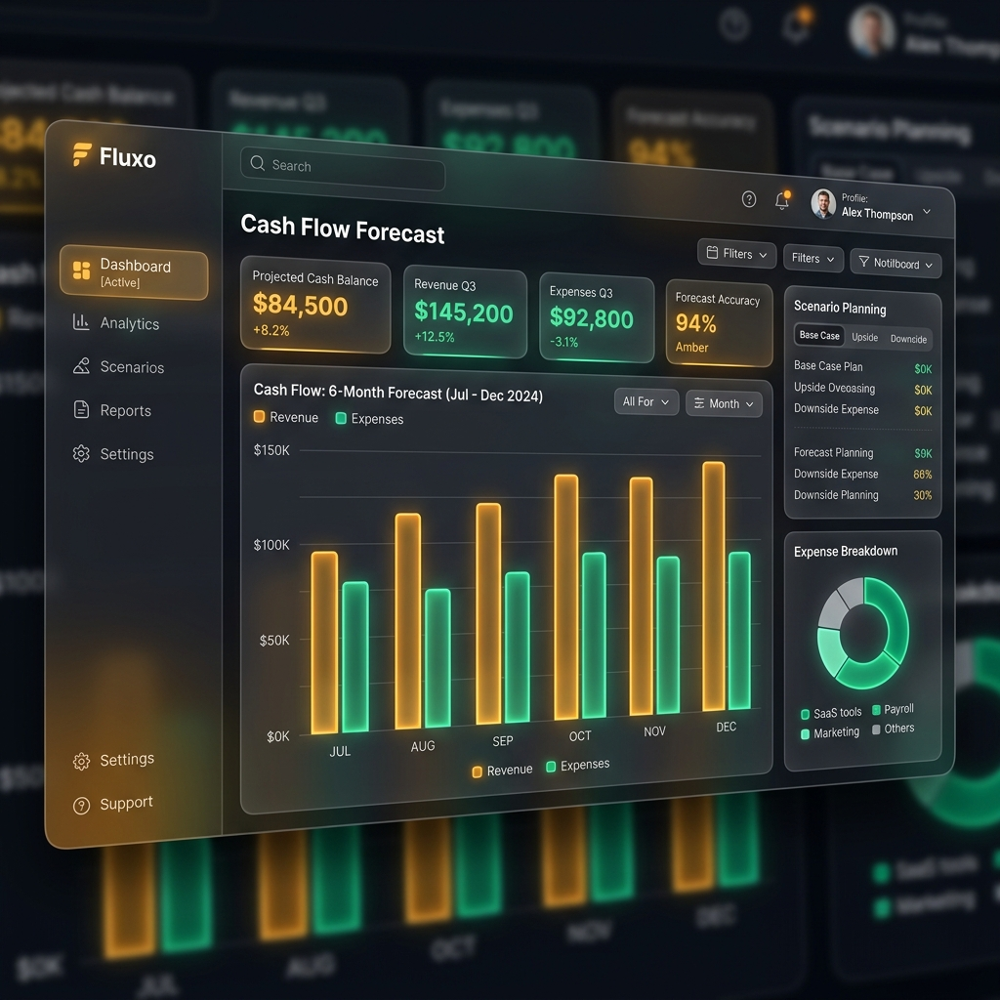

# Nexora CashFlow AI

## Overview
Nexora CashFlow AI is a production-ready SaaS platform designed to help SMEs forecast revenue, expenses, and cash flow accurately.

## Problem
Over 90% of Nigerian businesses are SMEs and many fail due to poor financial planning and lack of clear cash flow visibility.

## Why It Matters
Helping these businesses survive and thrive directly impacts the local economy, creating jobs and fostering innovation.

## Solution
This platform uses predictive analytics and AI to improve business decision-making by providing clear, data-driven financial forecasts.

## Features
- Cash Flow Forecasting
- Revenue & Expense Tracking
- AI-Powered Financial Advice (Powered by Gemini)
- Chatbot Assistant (Powered by Groq)
- Document Search & Embeddings (Powered by Cohere)

## Architecture
- **Frontend**: Next.js 15, TypeScript, TailwindCSS, Shadcn UI
- **Backend/API**: Next.js API Routes (or separate Node.js service)
- **Database**: PostgreSQL (via Supabase), Prisma ORM
- **AI Engine**: Groq, Gemini, Cohere APIs

## Documentation
- [API Documentation](docs/api-documentation.md)
- [Deployment Guide](docs/deployment-guide.md)

## Screenshots

## Tech Stack
Next.js 15, TypeScript, TailwindCSS, Shadcn UI, Supabase, PostgreSQL, Prisma ORM, Groq, Gemini, Cohere, Recharts and Vercel.

## Economic Impact
By reducing the failure rate of Nigerian SMEs through better financial planning, this tool aims to stabilize local businesses and contribute to sustainable economic growth.

## Future Improvements
- Integration with local bank APIs (e.g., Mono, Okra)
- Advanced scenario planning
- Mobile Application
